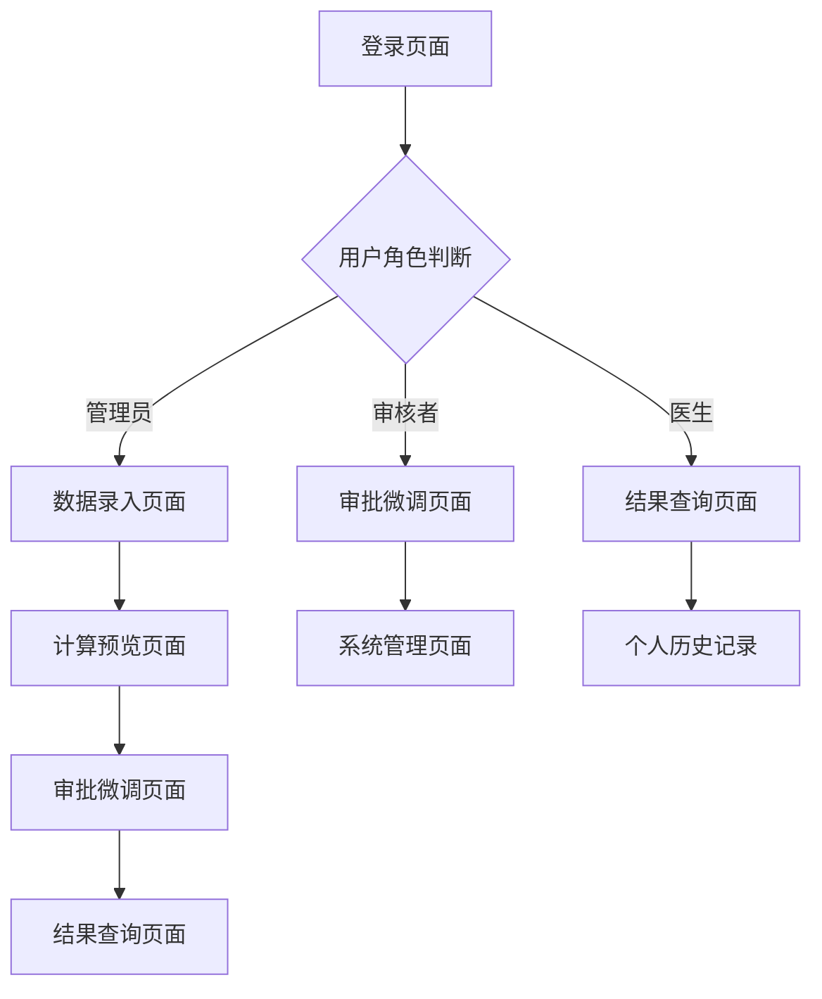

# 科室内部绩效分配微信小程序系统 - 产品需求文档

## 1. Product Overview

本系统是一个专为医院科室（如呼吸重症医学科）设计的绩效分配管理微信小程序，支持基于多维度指标的自动绩效计算、人工微调和透明化审批流程。
- 解决医院科室绩效分配不透明、计算复杂、缺乏公平性监督的问题，为科室医护人员提供公正、可追溯的绩效分配方案。
- 目标用户包括科主任、绩效主管、审核人员和科室医生，通过数字化手段提升绩效管理效率和公信力。

## 2. Core Features

### 2.1 User Roles

| Role | Registration Method | Core Permissions |
|------|---------------------|------------------|
| 管理员（科主任/绩效主管） | 系统管理员分配账号 | 查看编辑全部数据、设置绩效参数、审批最终结果 |
| 审核者 | 管理员邀请注册 | 确认数据准确性、提出调整建议、查看审批日志 |
| 医生 | 科室统一注册 | 查看个人绩效结果、提交申诉、查看个人历史记录 |

### 2.2 Feature Module

我们的科室绩效分配系统包含以下主要页面：
1. **数据录入页面**：基础数据录入、出勤记录管理、绩效参数设置
2. **计算预览页面**：绩效自动计算、结果预览、计算明细展示
3. **审批微调页面**：人工调整界面、调整依据记录、审批流程管理
4. **结果查询页面**：个人绩效查看、历史记录查询、统计报表
5. **系统管理页面**：用户权限管理、系统参数配置、日志查看

### 2.3 Page Details

| Page Name | Module Name | Feature description |
|-----------|-------------|---------------------|
| 数据录入页面 | 人员信息管理 | 添加编辑医生基本信息、职称年资设置、小组分配管理 |
| 数据录入页面 | 出勤记录录入 | 月度出勤天数录入、请假记录管理、出勤异常标记 |
| 数据录入页面 | 绩效数据录入 | 出院人数录入、床日数统计、基础工资设置、出勤表现评分 |
| 计算预览页面 | 自动计算引擎 | 基于权重规则计算绩效分值、职称系数动态调整、小组人数平衡计算 |
| 计算预览页面 | 结果预览 | 显示计算结果列表、个人明细展示、汇总统计信息 |
| 计算预览页面 | 计算明细 | 展示计算公式详情、各项得分明细、系数调整说明 |
| 审批微调页面 | 人工调整 | ±5%范围内微调、调整原因填写、调整前后对比 |
| 审批微调页面 | 审批流程 | 提交审批申请、审批状态跟踪、审批意见记录 |
| 审批微调页面 | 调整日志 | 记录所有调整操作、审批路径追踪、变更历史查看 |
| 结果查询页面 | 个人查询 | 个人绩效结果查看、历史记录查询、趋势分析 |
| 结果查询页面 | 统计报表 | 科室整体统计、月度对比分析、绩效分布图表 |
| 系统管理页面 | 用户管理 | 用户权限分配、角色管理、账号状态管理 |
| 系统管理页面 | 参数配置 | 绩效权重设置、职称系数配置、计算规则调整 |
| 系统管理页面 | 系统日志 | 操作日志查看、数据变更记录、系统异常监控 |

## 3. Core Process

**管理员流程：**
管理员登录系统后，首先录入或更新医生基本信息和绩效参数，然后录入月度出勤数据、出院人数、床日数等关键指标。系统自动计算绩效分值后，管理员可预览结果并进行必要的人工微调（±5%范围内），最后提交审批并发布最终结果。

**审核者流程：**
审核者接收到审批申请后，检查数据准确性和计算逻辑，对存在争议的分配结果提出调整建议，记录审核意见并确认或退回审批申请。

**医生流程：**
医生通过个人账号登录查看自己的绩效结果，包括各项得分明细和计算依据，如有异议可提交申诉，查看历史绩效记录和趋势变化。

## 4. User Interface Design

### 4.1 Design Style

- **主色调**：医疗蓝（#2E86AB）和清洁白（#FFFFFF），辅助色为警示橙（#F28E2C）
- **按钮样式**：圆角矩形按钮，主要操作使用医疗蓝，次要操作使用灰色边框
- **字体**：微软雅黑 14px（正文），16px（标题），12px（说明文字）
- **布局风格**：卡片式布局，顶部导航栏，清晰的信息层级和充足的留白
- **图标风格**：线性图标，医疗相关的专业图标，简洁现代的设计风格

### 4.2 Page Design Overview

| Page Name | Module Name | UI Elements |
|-----------|-------------|-------------|
| 数据录入页面 | 人员信息管理 | 表格式数据展示，浮动添加按钮，下拉选择职称，分组标签显示 |
| 数据录入页面 | 出勤记录录入 | 日历组件选择日期，数字输入框，异常标记红色高亮 |
| 计算预览页面 | 结果预览 | 卡片式结果展示，进度条显示得分，颜色编码区分等级 |
| 审批微调页面 | 人工调整 | 滑动条调整数值，文本框填写原因，对比表格显示变化 |
| 结果查询页面 | 个人查询 | 仪表盘式得分显示，折线图展示趋势，详情可展开收起 |
| 系统管理页面 | 用户管理 | 列表式用户展示，权限标签，开关控制账号状态 |

### 4.3 Responsiveness

系统采用移动端优先设计，主要适配微信小程序环境，支持竖屏操作和触摸交互优化。界面元素按照小程序设计规范进行适配，确保在不同尺寸手机上的良好显示效果。