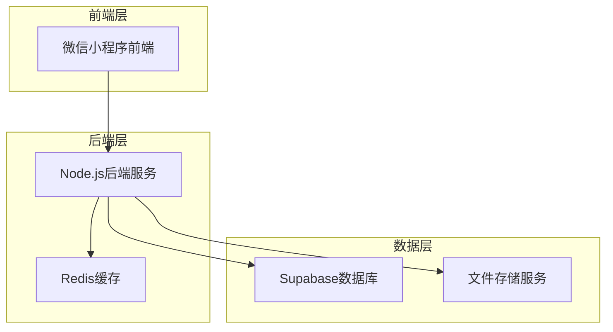
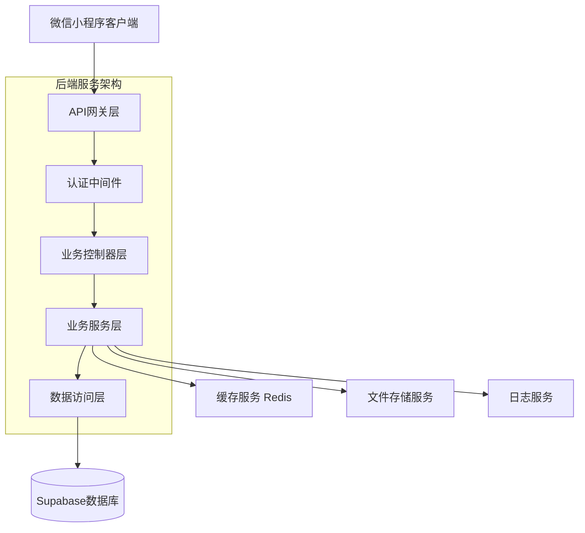
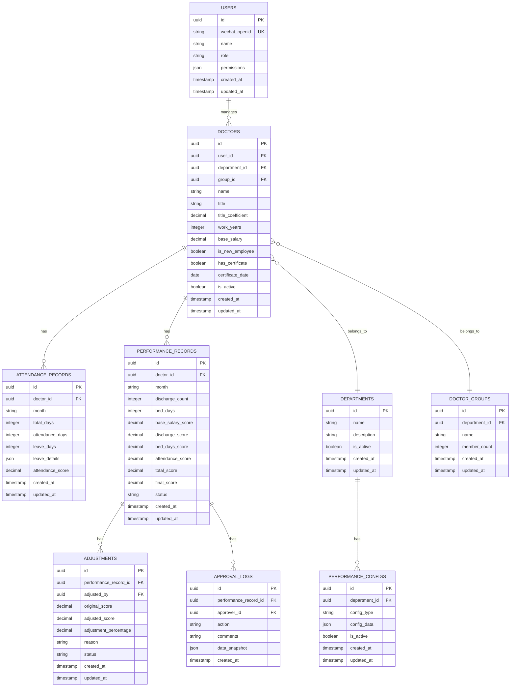

# 科室内部绩效分配微信小程序系统 - 技术架构文档

## 1. Architecture design



## 2. Technology Description

* 前端：微信小程序原生开发 + WeUI组件库

* 后端：Node.js + Express.js + TypeScript

* 数据库：Supabase (PostgreSQL)

* 缓存：Redis

* 文件存储：Supabase Storage

* 部署：Docker + Nginx

## 3. Route definitions

| Route                          | Purpose          |
| ------------------------------ | ---------------- |
| /pages/login/login             | 登录页面，用户身份验证和角色识别 |
| /pages/data-entry/data-entry   | 数据录入页面，录入绩效相关数据  |
| /pages/calculation/calculation | 计算预览页面，显示绩效计算结果  |
| /pages/approval/approval       | 审批微调页面，人工调整和审批流程 |
| /pages/results/results         | 结果查询页面，查看个人和整体绩效 |
| /pages/management/management   | 系统管理页面，用户和参数管理   |
| /pages/profile/profile         | 个人中心页面，个人信息和设置   |

## 4. API definitions

### 4.1 Core API

**用户认证相关**

```
POST /api/auth/login
```

Request:

| Param Name | Param Type | isRequired | Description |
| ---------- | ---------- | ---------- | ----------- |
| code       | string     | true       | 微信登录凭证      |
| userInfo   | object     | true       | 用户基本信息      |

Response:

| Param Name  | Param Type | Description |
| ----------- | ---------- | ----------- |
| token       | string     | JWT认证令牌     |
| userRole    | string     | 用户角色类型      |
| permissions | array      | 用户权限列表      |

**绩效数据管理**

```
POST /api/performance/calculate
```

Request:

| Param Name       | Param Type | isRequired | Description  |
| ---------------- | ---------- | ---------- | ------------ |
| month            | string     | true       | 计算月份 YYYY-MM |
| departmentId     | string     | true       | 科室ID         |
| forceRecalculate | boolean    | false      | 是否强制重新计算     |

Response:

| Param Name    | Param Type | Description |
| ------------- | ---------- | ----------- |
| calculationId | string     | 计算任务ID      |
| results       | array      | 绩效计算结果列表    |
| summary       | object     | 汇总统计信息      |

**数据录入相关**

```
POST /api/data/attendance
```

Request:

| Param Name     | Param Type | isRequired | Description |
| -------------- | ---------- | ---------- | ----------- |
| doctorId       | string     | true       | 医生ID        |
| month          | string     | true       | 月份 YYYY-MM  |
| attendanceDays | number     | true       | 出勤天数        |
| leaveRecords   | array      | false      | 请假记录        |

**审批流程相关**

```
POST /api/approval/submit
```

Request:

| Param Name    | Param Type | isRequired | Description |
| ------------- | ---------- | ---------- | ----------- |
| calculationId | string     | true       | 计算结果ID      |
| adjustments   | array      | false      | 调整项目列表      |
| reason        | string     | true       | 调整原因说明      |

## 5. Server architecture diagram



## 6. Data model

### 6.1 Data model definition



### 6.2 Data Definition Language

**用户表 (users)**

```sql
-- 创建用户表
CREATE TABLE users (
    id UUID PRIMARY KEY DEFAULT gen_random_uuid(),
    wechat_openid VARCHAR(100) UNIQUE NOT NULL,
    name VARCHAR(50) NOT NULL,
    role VARCHAR(20) NOT NULL CHECK (role IN ('admin', 'reviewer', 'doctor')),
    permissions JSONB DEFAULT '[]',
    created_at TIMESTAMP WITH TIME ZONE DEFAULT NOW(),
    updated_at TIMESTAMP WITH TIME ZONE DEFAULT NOW()
);

-- 创建索引
CREATE INDEX idx_users_wechat_openid ON users(wechat_openid);
CREATE INDEX idx_users_role ON users(role);

-- 权限设置
GRANT SELECT ON users TO anon;
GRANT ALL PRIVILEGES ON users TO authenticated;
```

**医生表 (doctors)**

```sql
-- 创建医生表
CREATE TABLE doctors (
    id UUID PRIMARY KEY DEFAULT gen_random_uuid(),
    user_id UUID REFERENCES users(id) ON DELETE CASCADE,
    department_id UUID REFERENCES departments(id),
    group_id UUID REFERENCES doctor_groups(id),
    name VARCHAR(50) NOT NULL,
    title VARCHAR(20) NOT NULL CHECK (title IN ('resident', 'attending', 'associate')),
    title_coefficient DECIMAL(3,2) NOT NULL DEFAULT 1.0,
    work_years INTEGER DEFAULT 0,
    base_salary DECIMAL(10,2) NOT NULL DEFAULT 0,
    is_active BOOLEAN DEFAULT true,
    created_at TIMESTAMP WITH TIME ZONE DEFAULT NOW(),
    updated_at TIMESTAMP WITH TIME ZONE DEFAULT NOW()
);

-- 创建索引
CREATE INDEX idx_doctors_department_id ON doctors(department_id);
CREATE INDEX idx_doctors_group_id ON doctors(group_id);
CREATE INDEX idx_doctors_title ON doctors(title);

-- 权限设置
GRANT SELECT ON doctors TO anon;
GRANT ALL PRIVILEGES ON doctors TO authenticated;
```

**科室表 (departments)**

```sql
-- 创建科室表
CREATE TABLE departments (
    id UUID PRIMARY KEY DEFAULT gen_random_uuid(),
    name VARCHAR(100) NOT NULL,
    description TEXT,
    is_active BOOLEAN DEFAULT true,
    created_at TIMESTAMP WITH TIME ZONE DEFAULT NOW(),
    updated_at TIMESTAMP WITH TIME ZONE DEFAULT NOW()
);

-- 权限设置
GRANT SELECT ON departments TO anon;
GRANT ALL PRIVILEGES ON departments TO authenticated;

-- 初始化数据
INSERT INTO departments (name, description) VALUES 
('呼吸重症医学科', '呼吸系统疾病诊疗和重症监护'),
('心血管内科', '心血管疾病诊疗'),
('神经内科', '神经系统疾病诊疗');
```

**医生小组表 (doctor\_groups)**

```sql
-- 创建医生小组表
CREATE TABLE doctor_groups (
    id UUID PRIMARY KEY DEFAULT gen_random_uuid(),
    department_id UUID REFERENCES departments(id),
    name VARCHAR(50) NOT NULL,
    member_count INTEGER DEFAULT 0,
    created_at TIMESTAMP WITH TIME ZONE DEFAULT NOW(),
    updated_at TIMESTAMP WITH TIME ZONE DEFAULT NOW()
);

-- 创建索引
CREATE INDEX idx_doctor_groups_department_id ON doctor_groups(department_id);

-- 权限设置
GRANT SELECT ON doctor_groups TO anon;
GRANT ALL PRIVILEGES ON doctor_groups TO authenticated;
```

**出勤记录表 (attendance\_records)**

```sql
-- 创建出勤记录表
CREATE TABLE attendance_records (
    id UUID PRIMARY KEY DEFAULT gen_random_uuid(),
    doctor_id UUID REFERENCES doctors(id) ON DELETE CASCADE,
    month VARCHAR(7) NOT NULL, -- YYYY-MM格式
    total_days INTEGER NOT NULL,
    attendance_days INTEGER NOT NULL,
    leave_days INTEGER DEFAULT 0,
    leave_details JSONB DEFAULT '[]',
    attendance_score DECIMAL(5,2) DEFAULT 0,
    created_at TIMESTAMP WITH TIME ZONE DEFAULT NOW(),
    updated_at TIMESTAMP WITH TIME ZONE DEFAULT NOW(),
    UNIQUE(doctor_id, month)
);

-- 创建索引
CREATE INDEX idx_attendance_records_doctor_id ON attendance_records(doctor_id);
CREATE INDEX idx_attendance_records_month ON attendance_records(month);

-- 权限设置
GRANT SELECT ON attendance_records TO anon;
GRANT ALL PRIVILEGES ON attendance_records TO authenticated;
```

**绩效记录表 (performance\_records)**

```sql
-- 创建绩效记录表
CREATE TABLE performance_records (
    id UUID PRIMARY KEY DEFAULT gen_random_uuid(),
    doctor_id UUID REFERENCES doctors(id) ON DELETE CASCADE,
    month VARCHAR(7) NOT NULL,
    discharge_count INTEGER DEFAULT 0,
    bed_days INTEGER DEFAULT 0,
    base_salary_score DECIMAL(10,2) DEFAULT 0,
    discharge_score DECIMAL(10,2) DEFAULT 0,
    bed_days_score DECIMAL(10,2) DEFAULT 0,
    attendance_score DECIMAL(10,2) DEFAULT 0,
    total_score DECIMAL(10,2) DEFAULT 0,
    final_score DECIMAL(10,2) DEFAULT 0,
    status VARCHAR(20) DEFAULT 'draft' CHECK (status IN ('draft', 'calculated', 'approved', 'published')),
    created_at TIMESTAMP WITH TIME ZONE DEFAULT NOW(),
    updated_at TIMESTAMP WITH TIME ZONE DEFAULT NOW(),
    UNIQUE(doctor_id, month)
);

-- 创建索引
CREATE INDEX idx_performance_records_doctor_id ON performance_records(doctor_id);
CREATE INDEX idx_performance_records_month ON performance_records(month);
CREATE INDEX idx_performance_records_status ON performance_records(status);

-- 权限设置
GRANT SELECT ON performance_records TO anon;
GRANT ALL PRIVILEGES ON performance_records TO authenticated;
```

**调整记录表 (adjustments)**

```sql
-- 创建调整记录表
CREATE TABLE adjustments (
    id UUID PRIMARY KEY DEFAULT gen_random_uuid(),
    performance_record_id UUID REFERENCES performance_records(id) ON DELETE CASCADE,
    adjusted_by UUID REFERENCES users(id),
    original_score DECIMAL(10,2) NOT NULL,
    adjusted_score DECIMAL(10,2) NOT NULL,
    adjustment_percentage DECIMAL(5,2) NOT NULL,
    reason TEXT NOT NULL,
    status VARCHAR(20) DEFAULT 'pending' CHECK (status IN ('pending', 'approved', 'rejected')),
    created_at TIMESTAMP WITH TIME ZONE DEFAULT NOW(),
    updated_at TIMESTAMP WITH TIME ZONE DEFAULT NOW()
);

-- 创建索引
CREATE INDEX idx_adjustments_performance_record_id ON adjustments(performance_record_id);
CREATE INDEX idx_adjustments_adjusted_by ON adjustments(adjusted_by);

-- 权限设置
GRANT SELECT ON adjustments TO anon;
GRANT ALL PRIVILEGES ON adjustments TO authenticated;
```

**审批日志表 (approval\_logs)**

```sql
-- 创建审批日志表
CREATE TABLE approval_logs (
    id UUID PRIMARY KEY DEFAULT gen_random_uuid(),
    performance_record_id UUID REFERENCES performance_records(id) ON DELETE CASCADE,
    approver_id UUID REFERENCES users(id),
    action VARCHAR(50) NOT NULL,
    comments TEXT,
    data_snapshot JSONB,
    created_at TIMESTAMP WITH TIME ZONE DEFAULT NOW()
);

-- 创建索引
CREATE INDEX idx_approval_logs_performance_record_id ON approval_logs(performance_record_id);
CREATE INDEX idx_approval_logs_approver_id ON approval_logs(approver_id);
CREATE INDEX idx_approval_logs_created_at ON approval_logs(created_at DESC);

-- 权限设置
GRANT SELECT ON approval_logs TO anon;
GRANT ALL PRIVILEGES ON approval_logs TO authenticated;
```

**绩效配置表 (performance\_configs)**

```sql
-- 创建绩效配置表
CREATE TABLE performance_configs (
    id UUID PRIMARY KEY DEFAULT gen_random_uuid(),
    department_id UUID REFERENCES departments(id),
    config_type VARCHAR(50) NOT NULL,
    config_data JSONB NOT NULL,
    is_active BOOLEAN DEFAULT true,
    created_at TIMESTAMP WITH TIME ZONE DEFAULT NOW(),
    updated_at TIMESTAMP WITH TIME ZONE DEFAULT NOW()
);

-- 创建索引
CREATE INDEX idx_performance_configs_department_id ON performance_configs(department_id);
CREATE INDEX idx_performance_configs_type ON performance_configs(config_type);

-- 权限设置
GRANT SELECT ON performance_configs TO anon;
GRANT ALL PRIVILEGES ON performance_configs TO authenticated;

-- 初始化绩效权重配置
INSERT INTO performance_configs (department_id, config_type, config_data) 
SELECT id, 'performance_weights', '{
  "base_salary": 0.5,
  "discharge_count": 0.15,
  "bed_days": 0.25,
  "attendance": 0.1
}' FROM departments WHERE name = '呼吸重症医学科';

-- 初始化职称系数配置
INSERT INTO performance_configs (department_id, config_type, config_data)
SELECT id, 'title_coefficients', '{
  "resident": 1.0,
  "attending": 1.2,
  "associate": 1.5
}' FROM departments WHERE name = '呼吸重症医学科';
```

