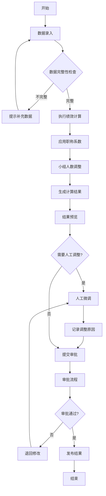
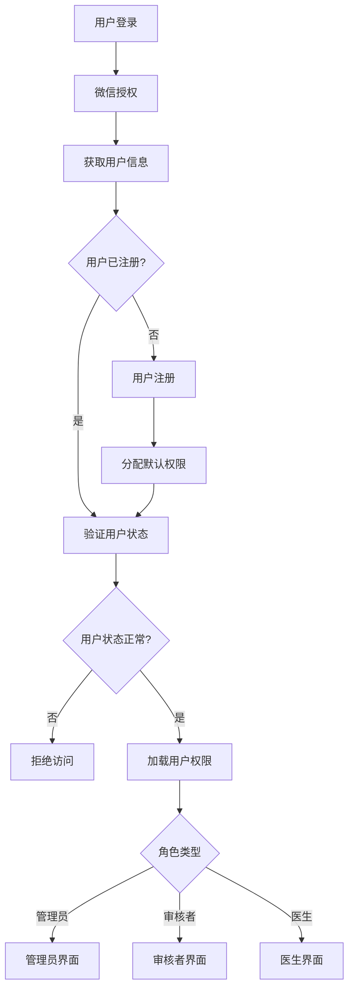
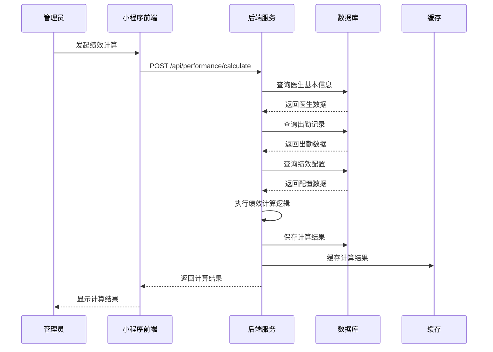
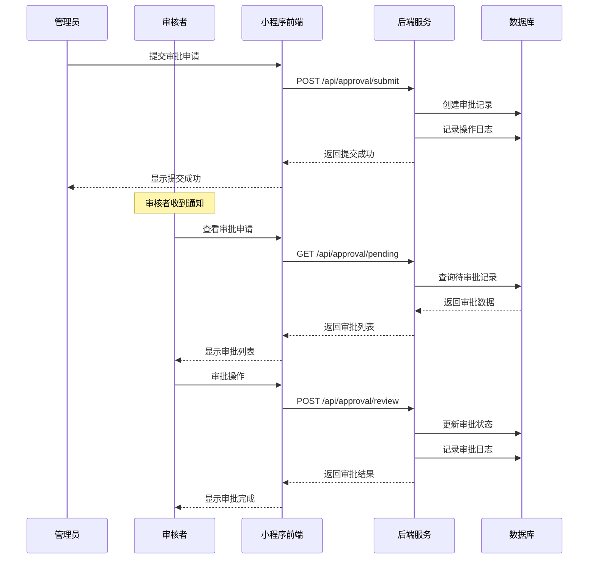
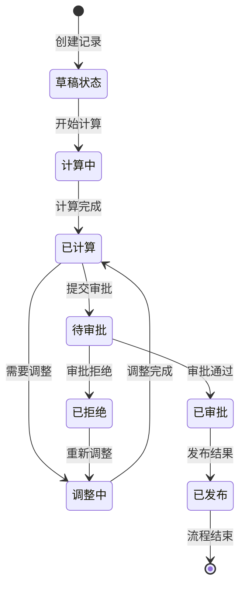
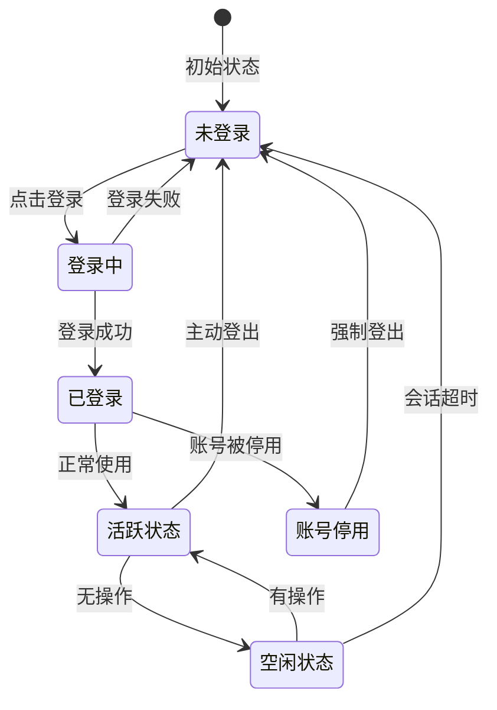
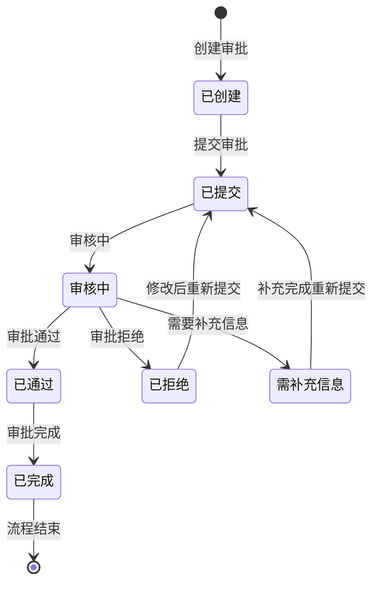
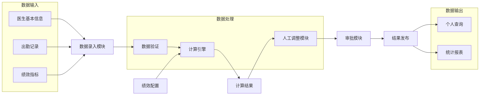

# 科室内部绩效分配微信小程序系统 - 系统规格文档

## 1. 需求分析

### 1.1 业务需求

**核心业务问题：**

* 医院科室绩效分配缺乏透明度和标准化流程

* 手工计算容易出错，效率低下

* 缺乏公平性监督机制和申诉渠道

* 调整依据不明确，缺乏可追溯性

**业务目标：**

* 实现绩效分配的自动化计算和标准化流程

* 提供透明、公正的绩效分配机制

* 建立完善的审批和监督体系

* 支持数据驱动的绩效管理决策

### 1.2 功能需求

**核心功能模块：**

1. **数据管理模块**

   * 医生基本信息管理（姓名、职称、年资、小组分配）

   * 出勤数据录入（出勤天数、请假记录）

   * 绩效指标录入（出院人数、床日数、基础工资）

2. **计算引擎模块**
   * 基于权重的自动绩效计算（基础工资50% + 出院人数15% + 床日数25% + 出勤10%）
   * 职称系数动态调整（住院医师1.0、主治医师1.2、副主任医师1.5）
   * 新入职人员系数调整（未取证0.6、取证三年内0.8）
   * 小组人数平衡算法

3. **审批管理模块**

   * 人工微调功能（±5%范围内）

   * 多级审批流程

   * 调整依据记录和追踪

4. **权限控制模块**

   * 三级权限管理（管理员、审核者、医生）

   * 数据访问控制

   * 操作日志记录

5. **查询统计模块**

   * 个人绩效查询

   * 科室统计报表

   * 历史数据分析

### 1.3 非功能需求

**性能要求：**

* 系统响应时间 < 2秒

* 支持并发用户数 > 50

* 数据计算准确率 99.9%

**安全要求：**

* 数据传输加密

* 用户身份认证

* 敏感数据脱敏

* 操作审计日志

**可用性要求：**

* 系统可用性 > 99%

* 支持7x24小时运行

* 数据备份和恢复

## 2. 技术选型

### 2.1 前端技术栈

* **开发框架**：微信小程序原生开发

* **UI组件库**：WeUI / Vant Weapp

* **状态管理**：小程序原生状态管理

* **网络请求**：wx.request API

### 2.2 后端技术栈

* **运行环境**：Node.js 18+

* **Web框架**：Express.js + TypeScript

* **数据库**：Supabase (PostgreSQL)

* **缓存**：Redis

* **认证**：JWT + 微信小程序登录

### 2.3 部署方案

* **容器化**：Docker + Docker Compose

* **反向代理**：Nginx

* **进程管理**：PM2

* **监控**：日志文件 + 系统监控

### 2.4 开发工具

* **代码管理**：Git

* **API文档**：Swagger/OpenAPI

* **测试框架**：Jest + Supertest

* **代码质量**：ESLint + Prettier

## 3. 流程图

### 3.1 绩效计算主流程



### 3.2 用户权限流程



## 4. 时序图

### 4.1 绩效计算时序图



### 4.2 审批流程时序图



## 5. 物件关联图

```mermaid
classDiagram
    class User {
        +String id
        +String wechatOpenid
        +String name
        +String role
        +Array permissions
        +login()
        +logout()
        +updateProfile()
    }
    
    class Doctor {
        +String id
        +String userId
        +String name
        +String title
        +Number titleCoefficient
        +Number workYears
        +Number baseSalary
        +calculatePerformance()
        +updateInfo()
    }
    
    class Department {
        +String id
        +String name
        +String description
        +Array doctors
        +addDoctor()
        +removeDoctor()
    }
    
    class DoctorGroup {
        +String id
        +String departmentId
        +String name
        +Number memberCount
        +addMember()
        +removeMember()
    }
    
    class AttendanceRecord {
        +String id
        +String doctorId
        +String month
        +Number attendanceDays
        +Number leaveDays
        +Number attendanceScore
        +calculate()
        +update()
    }
    
    class PerformanceRecord {
        +String id
        +String doctorId
        +String month
        +Number dischargeCount
        +Number bedDays
        +Number totalScore
        +Number finalScore
        +String status
        +calculate()
        +adjust()
        +approve()
    }
    
    class Adjustment {
        +String id
        +String performanceRecordId
        +String adjustedBy
        +Number originalScore
        +Number adjustedScore
        +String reason
        +String status
        +submit()
        +approve()
        +reject()
    }
    
    class ApprovalLog {
        +String id
        +String performanceRecordId
        +String approverId
        +String action
        +String comments
        +Object dataSnapshot
        +create()
    }
    
    class PerformanceConfig {
        +String id
        +String departmentId
        +String configType
        +Object configData
        +update()
        +activate()
    }
    
    User ||--o{ Doctor : manages
    Doctor }o--|| Department : belongs_to
    Doctor }o--|| DoctorGroup : belongs_to
    Doctor ||--o{ AttendanceRecord : has
    Doctor ||--o{ PerformanceRecord : has
    PerformanceRecord ||--o{ Adjustment : has
    PerformanceRecord ||--o{ ApprovalLog : has
    Department ||--o{ PerformanceConfig : has
    Department ||--o{ DoctorGroup : contains
```

## 6. 状态图

### 6.1 绩效记录状态图



### 6.2 用户会话状态图



### 6.3 审批流程状态图



## 7. 数据流图

### 7.1 系统数据流图



## 8. 接口规范

### 8.1 RESTful API 设计原则

* 使用标准HTTP方法（GET、POST、PUT、DELETE）

* 统一的响应格式和错误码

* 版本控制（/api/v1/）

* 请求和响应数据使用JSON格式

### 8.2 通用响应格式

```json
{
  "success": true,
  "code": 200,
  "message": "操作成功",
  "data": {},
  "timestamp": "2024-01-01T00:00:00Z"
}
```

### 8.3 错误码定义

* 200: 成功

* 400: 请求参数错误

* 401: 未授权

* 403: 权限不足

* 404: 资源不存在

* 500: 服务器内部错误

## 9. 安全设计

### 9.1 认证机制

* 微信小程序登录 + JWT Token

* Token有效期设置和自动刷新

* 多设备登录控制

### 9.2 权限控制

* 基于角色的访问控制（RBAC）

* 接口级权限验证

* 数据级权限过滤

### 9.3 数据安全

* 敏感数据加密存储

* 数据传输HTTPS加密

* 数据备份和恢复策略

### 9.4 审计日志

* 用户操作日志记录

* 数据变更追踪

* 异常访问监控

## 10. 性能优化

### 10.1 数据库优化

* 合理的索引设计

* 查询语句优化

* 数据分页处理

### 10.2 缓存策略

* Redis缓存热点数据

* 计算结果缓存

* 静态资源缓存

### 10.3 前端优化

* 组件懒加载

* 图片压缩和优化

* 网络请求优化

## 11. 测试策略

### 11.1 单元测试

* 核心业务逻辑测试

* 计算引擎准确性测试

* 工具函数测试

### 11.2 集成测试

* API接口测试

* 数据库操作测试

* 第三方服务集成测试

### 11.3 端到端测试

* 用户操作流程测试

* 跨页面功能测试

* 异常场景测试

### 11.4 性能测试

* 并发用户测试

* 压力测试

* 响应时间测试

