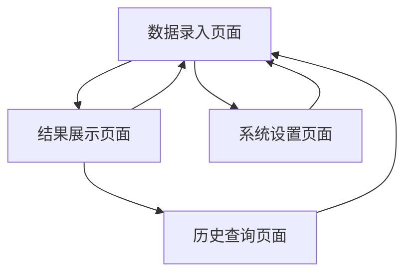

# 简化版科室绩效分配系统 - 产品需求文档

## 1. 产品概览

本系统是一个简化的科室组内绩效分配工具，专门用于医院科室内部快速计算和分配绩效奖金。系统去除了复杂的审批流程，专注于数据输入、实时计算和结果展示，让科室管理者能够快速、透明地进行绩效分配。

- 解决问题：简化科室内部绩效计算流程，提高分配效率和透明度
- 目标用户：科室主任、护士长等科室管理人员
- 核心价值：实时计算、操作简单、结果透明

## 2. 核心功能

### 2.1 用户角色

| 角色 | 使用方式 | 核心权限 |
|------|----------|----------|
| 科室管理员 | 直接访问系统 | 可录入数据、查看所有计算结果、管理历史记录 |

### 2.2 功能模块

系统包含以下核心页面：
1. **数据录入页面**：录入医生基本信息、出勤数据、工作量数据
2. **结果展示页面**：实时显示绩效计算结果、个人明细
3. **历史查询页面**：查看往期绩效分配记录
4. **系统设置页面**：配置绩效计算参数

### 2.3 页面详情

| 页面名称 | 模块名称 | 功能描述 |
|----------|----------|----------|
| 数据录入页面 | 医生信息管理 | 添加/编辑医生基本信息（姓名、职称、工作年限、是否新入职、取证情况） |
| 数据录入页面 | 出勤数据录入 | 录入每位医生的有效出勤天数 |
| 数据录入页面 | 工作量数据录入 | 录入出院人数、床日数等工作量指标 |
| 结果展示页面 | 实时计算显示 | 根据录入数据实时计算并显示每位医生的绩效分配结果 |
| 结果展示页面 | 明细展示 | 显示计算过程和各项系数的详细信息 |
| 历史查询页面 | 历史记录查看 | 按月份查看历史绩效分配记录 |
| 历史查询页面 | 数据导出 | 导出历史数据为Excel格式 |
| 系统设置页面 | 参数配置 | 设置绩效构成比例、职称系数等计算参数 |

## 3. 核心流程

### 主要操作流程：
1. **数据录入流程**：管理员打开系统 → 录入医生基本信息 → 录入出勤数据 → 录入工作量数据 → 系统自动计算
2. **结果查看流程**：查看实时计算结果 → 查看详细明细 → 确认分配方案
3. **历史查询流程**：选择查询月份 → 查看历史记录 → 导出数据（可选）

### 页面导航流程图：

## 4. 用户界面设计

### 4.1 设计风格
- **主色调**：蓝色系（#2196F3）和白色，体现医疗专业性
- **辅助色**：绿色（#4CAF50）表示成功，橙色（#FF9800）表示警告
- **按钮风格**：圆角矩形，简洁现代
- **字体**：微软雅黑，主标题16px，正文14px，说明文字12px
- **布局风格**：卡片式布局，清晰的模块划分
- **图标风格**：线性图标，简洁明了

### 4.2 页面设计概览

| 页面名称 | 模块名称 | UI元素 |
|----------|----------|--------|
| 数据录入页面 | 医生信息管理 | 表格形式，支持行内编辑，新增/删除按钮，职称下拉选择 |
| 数据录入页面 | 数据录入区域 | 分组卡片布局，数字输入框，实时验证提示 |
| 结果展示页面 | 计算结果展示 | 响应式表格，颜色编码显示不同绩效等级，排序功能 |
| 结果展示页面 | 明细面板 | 可展开的详情面板，饼图显示绩效构成 |
| 历史查询页面 | 查询控件 | 月份选择器，搜索框，筛选按钮 |
| 历史查询页面 | 历史数据表格 | 分页表格，导出按钮，对比功能 |
| 系统设置页面 | 参数配置 | 滑块控件设置比例，输入框设置系数，保存/重置按钮 |

### 4.3 响应性
- **设计原则**：桌面优先，兼容平板设备
- **断点设置**：1200px以上为桌面版，768px-1200px为平板版
- **交互优化**：支持键盘快捷键，鼠标悬停效果
- **数据展示**：大屏幕显示完整表格，小屏幕采用卡片式布局