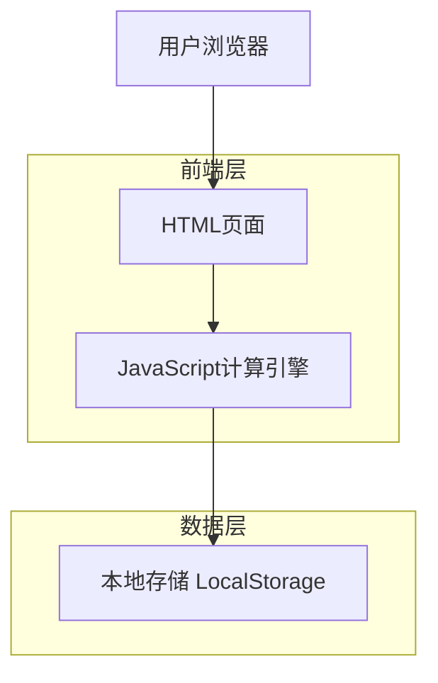

# 简化版科室绩效分配系统 - 技术架构文档

## 1. 架构设计



## 2. 技术描述

- **前端**：HTML5 + CSS3 + JavaScript ES6+ + Bootstrap 5
- **数据存储**：浏览器 LocalStorage
- **图表库**：Chart.js（用于绩效构成饼图）
- **UI框架**：Bootstrap 5（响应式布局）
- **构建工具**：无需构建，直接运行

## 3. 页面路由定义

| 页面文件 | 功能描述 |
|----------|----------|
| index.html | 主页面，包含数据录入功能 |
| results.html | 结果展示页面，显示计算结果和明细 |
| history.html | 历史查询页面，查看往期记录 |
| settings.html | 系统设置页面，配置计算参数 |

## 4. 核心JavaScript模块

### 4.1 数据模型定义

```javascript
// 医生信息模型
const DoctorModel = {
    id: String,           // 医生ID
    name: String,         // 姓名
    title: String,        // 职称（住院医师/主治医师/副主任医师/主任医师）
    workYears: Number,    // 工作年限
    isNewEmployee: Boolean, // 是否新入职员工
    hasCertificate: Boolean, // 是否已取证
    certificateDate: Date,   // 取证日期
    titleCoefficient: Number // 职称系数
};

// 绩效数据模型
const PerformanceModel = {
    id: String,           // 记录ID
    month: String,        // 月份（YYYY-MM）
    doctorId: String,     // 医生ID
    attendanceDays: Number, // 出勤天数
    dischargeCount: Number, // 出院人数
    bedDays: Number,      // 床日数
    baseSalary: Number,   // 基础工资
    totalScore: Number,   // 总绩效分
    finalAmount: Number,  // 最终分配金额
    createdAt: Date       // 创建时间
};

// 系统配置模型
const ConfigModel = {
    baseSalaryRatio: 0.5,    // 基础工资占比 50%
    dischargeRatio: 0.15,    // 出院人数占比 15%
    bedDaysRatio: 0.25,      // 床日数占比 25%
    attendanceRatio: 0.1,    // 出勤占比 10%
    titleCoefficients: {     // 职称系数
        '住院医师': 1.0,
        '主治医师': 1.2,
        '副主任医师': 1.5,
        '主任医师': 1.8
    },
    newEmployeeCoefficients: { // 新入职员工系数
        'uncertified': 0.6,      // 未取证
        'within3years': 0.8      // 取证三年内
    }
};
```

### 4.2 核心计算引擎

```javascript
/**
 * 绩效计算引擎
 */
class PerformanceCalculator {
    /**
     * 计算单个医生的绩效
     * @param {Object} doctor - 医生信息
     * @param {Object} workData - 工作数据
     * @param {Object} config - 系统配置
     * @returns {Object} 计算结果
     */
    static calculatePerformance(doctor, workData, config) {
        // 基础工资部分
        const baseSalaryScore = workData.baseSalary * config.baseSalaryRatio;
        
        // 工作量部分（需要根据科室总量计算比例）
        const dischargeScore = workData.dischargeCount * config.dischargeRatio;
        const bedDaysScore = workData.bedDays * config.bedDaysRatio;
        const attendanceScore = workData.attendanceDays * config.attendanceRatio;
        
        // 基础总分
        let totalScore = baseSalaryScore + dischargeScore + bedDaysScore + attendanceScore;
        
        // 应用职称系数
        const titleCoeff = config.titleCoefficients[doctor.title] || 1.0;
        totalScore *= titleCoeff;
        
        // 应用新入职员工系数
        const newEmployeeCoeff = this.getNewEmployeeCoefficient(doctor, config);
        totalScore *= newEmployeeCoeff;
        
        return {
            doctorId: doctor.id,
            baseSalaryScore,
            dischargeScore,
            bedDaysScore,
            attendanceScore,
            titleCoefficient: titleCoeff,
            newEmployeeCoefficient: newEmployeeCoeff,
            totalScore,
            finalAmount: totalScore // 在实际分配时会根据总预算调整
        };
    }
    
    /**
     * 获取新入职员工系数
     * @param {Object} doctor - 医生信息
     * @param {Object} config - 系统配置
     * @returns {Number} 新入职员工系数
     */
    static getNewEmployeeCoefficient(doctor, config) {
        if (!doctor.isNewEmployee) return 1.0;
        
        if (!doctor.hasCertificate) {
            return config.newEmployeeCoefficients.uncertified; // 0.6
        }
        
        // 检查取证是否在三年内
        const now = new Date();
        const certDate = new Date(doctor.certificateDate);
        const yearsDiff = (now - certDate) / (1000 * 60 * 60 * 24 * 365);
        
        if (yearsDiff <= 3) {
            return config.newEmployeeCoefficients.within3years; // 0.8
        }
        
        return 1.0; // 超过三年按正常系数
    }
}
```

### 4.3 数据存储管理

```javascript
/**
 * 本地存储管理器
 */
class StorageManager {
    static KEYS = {
        DOCTORS: 'performance_doctors',
        RECORDS: 'performance_records',
        CONFIG: 'performance_config'
    };
    
    /**
     * 保存医生信息
     * @param {Array} doctors - 医生列表
     */
    static saveDoctors(doctors) {
        localStorage.setItem(this.KEYS.DOCTORS, JSON.stringify(doctors));
    }
    
    /**
     * 获取医生信息
     * @returns {Array} 医生列表
     */
    static getDoctors() {
        const data = localStorage.getItem(this.KEYS.DOCTORS);
        return data ? JSON.parse(data) : [];
    }
    
    /**
     * 保存绩效记录
     * @param {Array} records - 绩效记录列表
     */
    static saveRecords(records) {
        localStorage.setItem(this.KEYS.RECORDS, JSON.stringify(records));
    }
    
    /**
     * 获取绩效记录
     * @param {String} month - 月份筛选（可选）
     * @returns {Array} 绩效记录列表
     */
    static getRecords(month = null) {
        const data = localStorage.getItem(this.KEYS.RECORDS);
        const records = data ? JSON.parse(data) : [];
        
        if (month) {
            return records.filter(record => record.month === month);
        }
        
        return records;
    }
    
    /**
     * 保存系统配置
     * @param {Object} config - 系统配置
     */
    static saveConfig(config) {
        localStorage.setItem(this.KEYS.CONFIG, JSON.stringify(config));
    }
    
    /**
     * 获取系统配置
     * @returns {Object} 系统配置
     */
    static getConfig() {
        const data = localStorage.getItem(this.KEYS.CONFIG);
        return data ? JSON.parse(data) : ConfigModel;
    }
}
```

## 5. 文件结构

```
简化版科室绩效分配系统/
├── index.html              # 主页面（数据录入）
├── results.html            # 结果展示页面
├── history.html            # 历史查询页面
├── settings.html           # 系统设置页面
├── css/
│   ├── bootstrap.min.css   # Bootstrap样式
│   └── custom.css          # 自定义样式
├── js/
│   ├── bootstrap.min.js    # Bootstrap脚本
│   ├── chart.min.js        # Chart.js图表库
│   ├── models.js           # 数据模型定义
│   ├── calculator.js       # 绩效计算引擎
│   ├── storage.js          # 存储管理器
│   ├── main.js             # 主页面逻辑
│   ├── results.js          # 结果页面逻辑
│   ├── history.js          # 历史页面逻辑
│   └── settings.js         # 设置页面逻辑
└── README.md               # 项目说明文档
```

## 6. 部署说明

### 6.1 环境要求
- 现代浏览器（Chrome 60+, Firefox 60+, Safari 12+, Edge 79+）
- 支持 LocalStorage
- 支持 ES6+ JavaScript

### 6.2 部署方式
1. **本地部署**：直接双击 index.html 文件即可运行
2. **Web服务器部署**：将所有文件上传到Web服务器目录
3. **内网部署**：部署到内网服务器，供科室内部访问

### 6.3 数据备份
- 定期导出 LocalStorage 数据
- 支持数据导入/导出功能
- 建议定期备份浏览器数据