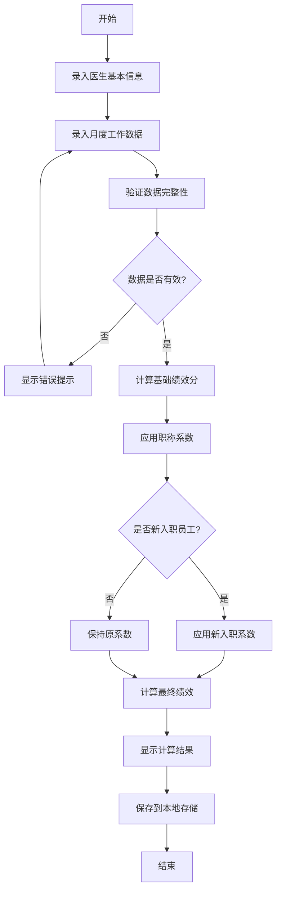
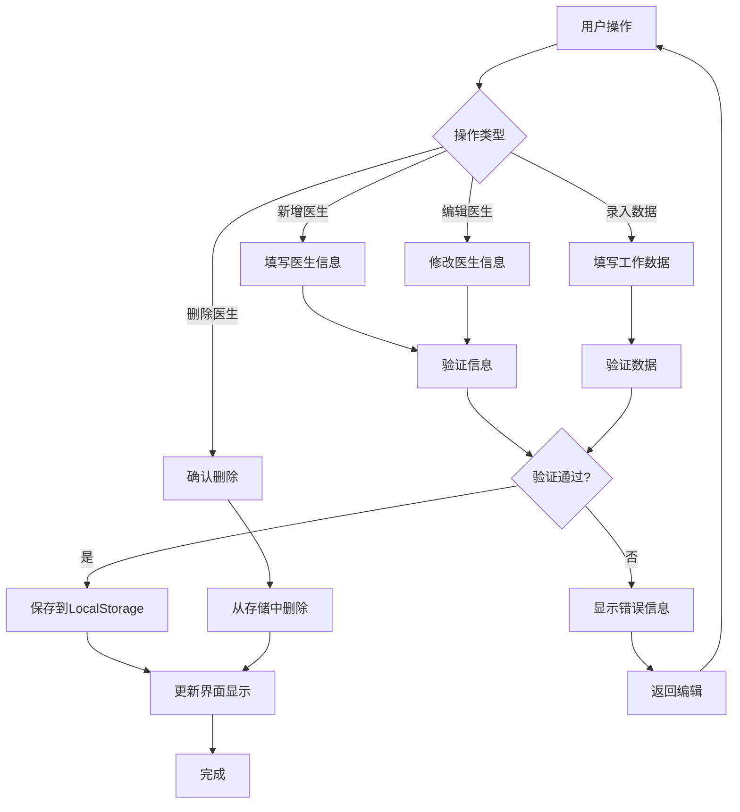
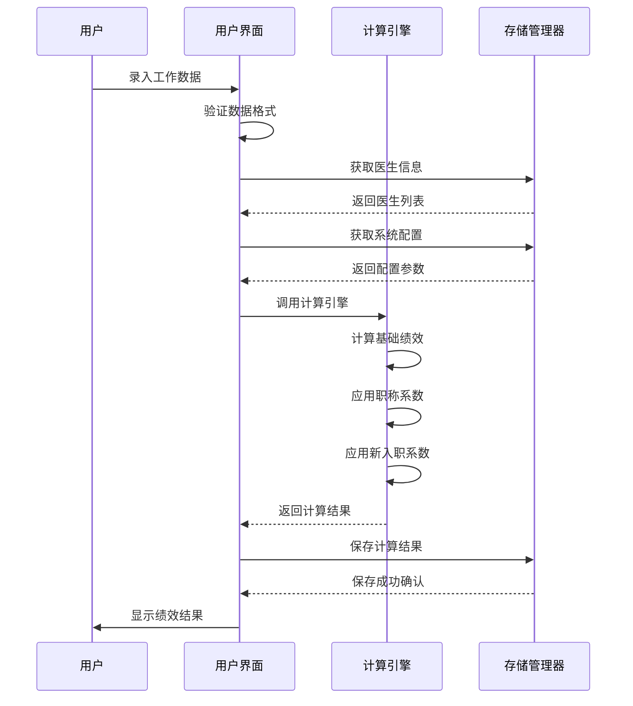
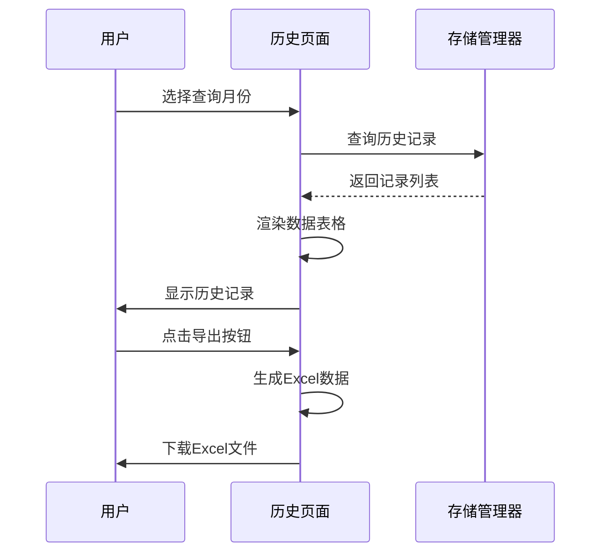
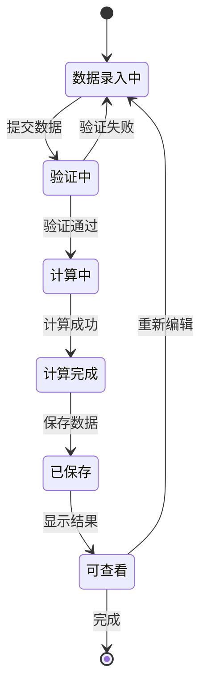
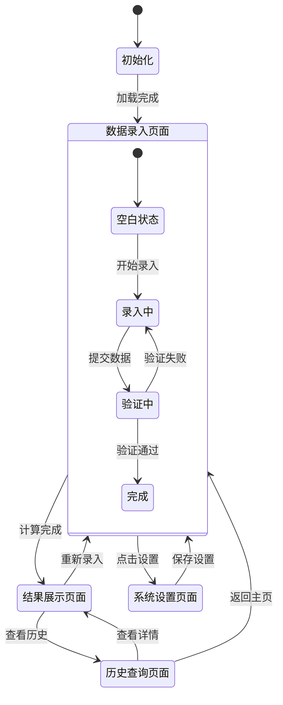
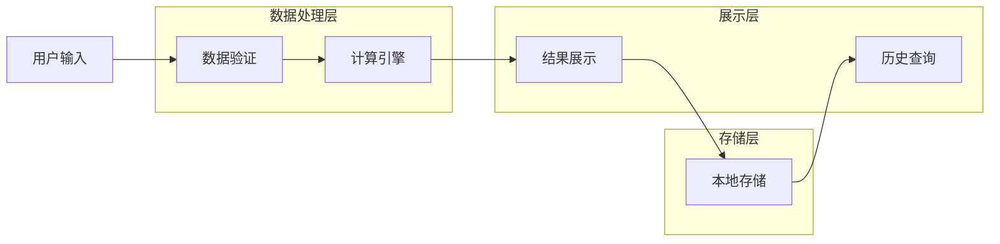
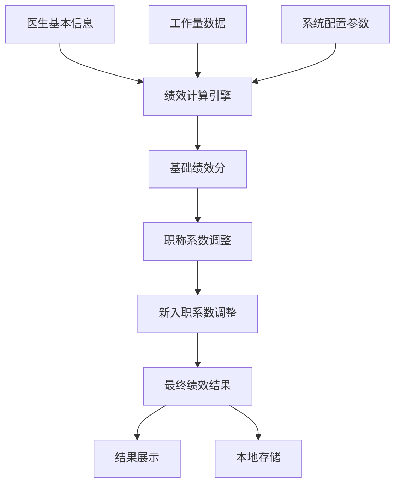

# 简化版科室绩效分配系统 - 系统规格文档

## 1. 需求分析

### 1.1 业务需求
- **核心问题**：科室内部绩效分配计算复杂，需要简单快捷的工具
- **业务目标**：提供实时、透明、准确的绩效分配计算
- **使用场景**：科室主任每月进行绩效分配时使用
- **业务价值**：提高分配效率，减少计算错误，增加透明度

### 1.2 功能需求

#### 1.2.1 数据管理功能
- 医生基本信息管理（姓名、职称、工作年限、新入职状态）
- 月度工作数据录入（出勤天数、出院人数、床日数、基础工资）
- 数据验证和错误提示
- 数据导入导出功能

#### 1.2.2 计算引擎功能
- 基础绩效计算（基础工资50% + 出院人数15% + 床日数25% + 出勤10%）
- 职称系数应用（住院医师1.0、主治医师1.2、副主任医师1.5、主任医师1.8）
- 新入职人员系数调整（未取证0.6、取证三年内0.8）
- 实时计算和结果更新

#### 1.2.3 结果展示功能
- 绩效分配结果表格显示
- 个人绩效明细展示
- 计算过程透明化显示
- 绩效构成图表展示

#### 1.2.4 历史管理功能
- 按月份查看历史记录
- 历史数据对比分析
- 数据导出为Excel格式

### 1.3 非功能需求
- **性能要求**：页面响应时间 < 1秒
- **可用性要求**：界面简洁直观，无需培训即可使用
- **兼容性要求**：支持主流浏览器
- **数据安全**：本地存储，数据不外泄
- **可维护性**：代码结构清晰，易于修改参数

## 2. 技术选型

### 2.1 前端技术
- **HTML5**：页面结构和语义化标记
- **CSS3 + Bootstrap 5**：响应式布局和UI组件
- **JavaScript ES6+**：业务逻辑和交互功能
- **Chart.js**：数据可视化图表

### 2.2 数据存储
- **LocalStorage**：浏览器本地存储，无需服务器
- **JSON格式**：数据序列化和反序列化

### 2.3 开发工具
- **VS Code**：代码编辑器
- **Chrome DevTools**：调试工具
- **Git**：版本控制

## 3. 流程图

### 3.1 绩效计算主流程



### 3.2 数据管理流程



## 4. 时序图

### 4.1 绩效计算时序图



### 4.2 历史查询时序图



## 5. 物件关联图

```mermaid
classDiagram
    class Doctor {
        +String id
        +String name
        +String title
        +Number workYears
        +Boolean isNewEmployee
        +Boolean hasCertificate
        +Date certificateDate
        +Number titleCoefficient
        +getTitleCoefficient()
        +getNewEmployeeCoefficient()
    }
    
    class PerformanceRecord {
        +String id
        +String month
        +String doctorId
        +Number attendanceDays
        +Number dischargeCount
        +Number bedDays
        +Number baseSalary
        +Number totalScore
        +Number finalAmount
        +Date createdAt
        +calculate()
        +save()
    }
    
    class SystemConfig {
        +Number baseSalaryRatio
        +Number dischargeRatio
        +Number bedDaysRatio
        +Number attendanceRatio
        +Object titleCoefficients
        +Object newEmployeeCoefficients
        +update()
        +reset()
    }
    
    class PerformanceCalculator {
        +calculatePerformance(doctor, workData, config)
        +getNewEmployeeCoefficient(doctor, config)
        +validateData(data)
    }
    
    class StorageManager {
        +saveDoctors(doctors)
        +getDoctors()
        +saveRecords(records)
        +getRecords(month)
        +saveConfig(config)
        +getConfig()
        +exportData()
        +importData()
    }
    
    class UIController {
        +renderDoctorList()
        +renderResults()
        +handleDataInput()
        +showErrorMessage()
        +exportToExcel()
    }
    
    Doctor ||--o{ PerformanceRecord : "has many"
    PerformanceCalculator ..> Doctor : "uses"
    PerformanceCalculator ..> PerformanceRecord : "creates"
    PerformanceCalculator ..> SystemConfig : "uses"
    StorageManager ..> Doctor : "manages"
    StorageManager ..> PerformanceRecord : "manages"
    StorageManager ..> SystemConfig : "manages"
    UIController ..> StorageManager : "uses"
    UIController ..> PerformanceCalculator : "uses"
```

## 6. 状态图

### 6.1 绩效记录状态图



### 6.2 用户界面状态图



## 7. 数据流图

### 7.1 系统数据流图



### 7.2 绩效计算数据流



## 8. 接口规范

### 8.1 JavaScript API设计

```javascript
// 计算引擎接口
interface PerformanceCalculator {
    calculatePerformance(doctor: Doctor, workData: WorkData, config: Config): PerformanceResult;
    validateData(data: any): ValidationResult;
}

// 存储管理接口
interface StorageManager {
    saveDoctors(doctors: Doctor[]): boolean;
    getDoctors(): Doctor[];
    saveRecords(records: PerformanceRecord[]): boolean;
    getRecords(month?: string): PerformanceRecord[];
    exportData(format: string): string;
}

// UI控制器接口
interface UIController {
    renderPage(pageType: string): void;
    handleUserInput(event: Event): void;
    showMessage(message: string, type: string): void;
}
```

### 8.2 数据格式规范

```javascript
// 医生信息格式
const doctorSchema = {
    id: "string",
    name: "string",
    title: "enum[住院医师,主治医师,副主任医师,主任医师]",
    workYears: "number",
    isNewEmployee: "boolean",
    hasCertificate: "boolean",
    certificateDate: "date|null"
};

// 工作数据格式
const workDataSchema = {
    doctorId: "string",
    month: "string(YYYY-MM)",
    attendanceDays: "number",
    dischargeCount: "number",
    bedDays: "number",
    baseSalary: "number"
};
```

## 9. 安全设计

### 9.1 数据安全
- **本地存储**：数据仅存储在用户浏览器本地，不上传到服务器
- **数据验证**：前端进行数据格式和范围验证
- **备份机制**：支持数据导出备份功能

### 9.2 输入安全
- **XSS防护**：对用户输入进行HTML转义
- **数据类型检查**：严格验证输入数据类型
- **范围限制**：对数值输入设置合理范围限制

## 10. 性能优化

### 10.1 前端优化
- **懒加载**：按需加载JavaScript模块
- **缓存策略**：合理使用浏览器缓存
- **DOM优化**：减少DOM操作，使用文档片段

### 10.2 数据优化
- **分页显示**：历史记录采用分页显示
- **索引优化**：为常用查询字段建立索引
- **压缩存储**：对大量数据进行压缩存储

## 11. 测试策略

### 11.1 功能测试
- **单元测试**：测试计算引擎的各个函数
- **集成测试**：测试各模块间的数据流
- **用户测试**：模拟真实使用场景

### 11.2 兼容性测试
- **浏览器兼容性**：测试主流浏览器
- **设备兼容性**：测试不同屏幕尺寸
- **性能测试**：测试大数据量下的性能表现